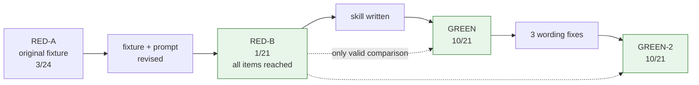

# What changed in skills — the `nasa-coding-standards` branch

**Scope:** `bfade18..HEAD` (branch `claude/nasa-coding-standards-0ba3cb`) · 15 commits · 8 files ·
+3,333 / −12 lines
**Contributor:** Michael Harris
**Read time:** ~6 min

## The short version

A new agent skill, `nasa-coding-standards`, that applies a TypeScript/Node port of the NASA/JPL
"Power of 10" rules to code that moves money, changes access, can't be undone, crosses a trust
boundary, or waits on external state. It ships as four files under `skills/nasa-coding-standards/`
and is wired into the plugin manifest.

The skill itself is about 1,100 words. The other 4,700 words are the behavioural test record, and
that ratio is the point: the baseline ran **before** the skill was written, per this repo's
doctrine, and the record says plainly where the skill works and where it doesn't. It works on two
rules and reliably fails on two others. The pre-registered pass bar was **not met**, and the bar
was not moved to fit.

## Themes

### 1. The port: ten C rules adjudicated, not translated

`rules.md` records all ten originals in one uniform shape — **Original → Port → What did not
survive** — including the ones that port cleanly. The adjudication criterion is that *a rule ports
when its invariant survives the death of its mechanism*.

That criterion does real work rather than decorating a decision already made. Rule 3's mechanism
(no `malloc` after init) is meaningless under GC, but its invariant — resource use is derivable
from the source, not the input — survives. The tempting reframing of rule 3 as "avoid allocation
churn to reduce GC pauses" is **explicitly rejected**, because it borrows the determinism
rationale for something no tool can check, and mechanical checkability was Holzmann's own design
constraint.

Outcome: seven rules port to a key, two (function length, smallest scope) defer to conventions
this org already enforces, and **rule 8 is dropped outright** — TypeScript has no preprocessor,
and inventing an analogue would have been easy and dishonest.

The seven keys: `bounded-recursion`, `bounded-loop`, `bounded-memory`, `assert-invariants`,
`failure-path`, `resolvable-dispatch`, `no-suppressed-diagnostics`.

### 2. The skill: structural applicability plus a disclosure contract

`SKILL.md` is the always-loaded half. Two ideas do most of the work, and both came from the
baseline rather than from the design:

- **Applicability is structural, not a judgment.** Each rule gets a "applies when" test checkable
  against the code, because making relaxation hard pushes an agent's cheapest exit toward
  deciding a rule *didn't apply* — and unlike a relaxation, that judgment leaves nothing to review.
- **You own what you touch.** The baseline showed agents scope by authorship: one rep said so
  outright, *"that's a pre-existing gap … not something introduced here."*

Relaxations must cite an **external, locatable** guarantee — a config key, a type, a caller
contract — never a likelihood, and must be written at the site as a grep-able
`// po10-relaxed(rule): guarantee (where it lives)` comment. `failure-path` and
`no-suppressed-diagnostics` can't be relaxed at all: each already contains its own one-line
minimum, so relaxing either is skipping compliance, not trading it.

After a change, one bullet per rule under which the agent *changed code or relaxed the rule*, with
a required `file:symbol` anchor. If nothing changed, no block — silence is the correct output.

### 3. The test: a fixture that had to be rebuilt mid-experiment

`make-fixture.sh` builds a `billing-events` TypeScript service — a refund webhook handler,
deliberately **not** framed as safety-critical, because a fixture that looks important gets
carefulness for free and stops discriminating. Eight defects are planted, one per surviving rule,
and `src/charges.ts` checks `res.ok` correctly as a control for style-copying.

The first baseline (RED-A) exposed a fixture defect: three of the eight defects came back **not
reached** rather than not addressed. Every rep called `reconcileCharge` without modifying it and
none opened `metadata.ts` — which is *correct* behaviour under the skill's own scope rule, and
which made the pre-registered GREEN bar unsatisfiable by construction.

So the fixture and prompt were revised — `countRefunds` now returns a count so the feature must
own the paginating loop, and `flattenMetadata` is non-recursive so the agent authors the recursion
itself. Both runs are reported; GREEN is compared only against RED-B.



## What changed where

| Area | What happened | Files | Why it matters |
|---|---|---|---|
| The skill | Trigger description, structural applicability table, relaxation rules, disclosure contract, rationalizations | `skills/nasa-coding-standards/SKILL.md` (1,089 w) | Loaded on every fire — this is the context cost and the behaviour |
| The rule set | Ten rules adjudicated; 7 ported, 2 deferred, 1 dropped | `rules.md` (1,472 w) | Loaded on demand; the future audit skill reads the same file |
| The record | Pre-registration, 5 arms, confound disclosure, 7 open questions | `TESTING.md` (5,889 w) | The only evidence any claim here rests on |
| The fixture | Refund webhook service, 8 planted defects, 1 control | `make-fixture.sh` | Reproducible; verified to build and typecheck clean |
| Manifest | Description clause + 4 keywords. **Version untouched** | `.claude-plugin/plugin.json` | Discoverability; the release owns the bump |
| Install notes | Per-skill installed-vs-edited state, verified 2026-09-03 | `CLAUDE.md` | Records which skills are actually live |
| Design + plan | Spec and the 9-task plan that argues from it | `docs/superpowers/{specs,plans}/` | The plan travels with the work |

## Results

| Arm | Score | Note |
|---|---|---|
| RED-A (original fixture) | 3/24 | Items 4–6 unreached — fixture defect |
| **RED-B (revised)** | **1/21** | Every item reached; the real baseline |
| GREEN | 10/21 | Bar not met |
| GREEN-2 (after 3 fixes) | **10/21** | Same total, failures redistributed |
| Over-fire | clean 2/2 | Agent just writes the helper |
| Opt-in (`all-code` marker) | pass | Marker read and cited |

**What reliably works** — `res.ok` and `bounded-recursion`, both 0/6 → 6/6.

**What reliably fails** — `resolvable-dispatch` 0/6, and it got *worse*: re-aiming the rule made
it fire without making its compliant minimum reachable from the edit, so 2 of 3 reps redescribed
the unsafe `Record` map as "the existing allowlisted handler map, which already rejects unknown
types". **A rule that fires but can't be satisfied by the edit in front of you gets reported as
satisfied.** That is the most transferable finding here.

## Details worth knowing

- **The GREEN results are confounded, and the record says so.** The skill's own disclosure example
  named the fixture's exact files and symbols. Every GREEN rep read it before editing; the items
  it spelled out improved most, and the one scored item absent from it never improved. The example
  now uses non-fixture symbols, but no arm has run against the corrected version.
- **The trigger has never been tested.** A dispatched subagent sees the skill's *name*, not its
  description. Every under-fire result is a test of the body under a name-only trigger. The five
  categorical tests — which the design calls "the product" — are unmeasured, and testing them
  needs an interactive session.
- **A disclosure bullet can't be trusted without reading the code.** Three of twelve blocks across
  both GREEN runs carried a factually false compliance claim with a *correct* `file:symbol`
  anchor. The anchor makes a claim locatable, not true.
- **`bounded-loop` and `bounded-memory` interact.** Capping the loop reads as discharging the
  obligation to bound the memory — GREEN-2 is 3/3 on the first and 0/3 on the second, in the same
  function. They may need to be one rule.
- **Rule 9's port is the one that's contestable** under the skill's own criterion. A bare
  `Record<string, fn>` literal already has a statically enumerable callee set, so the allowlist
  requirement enforces input validation rather than call-graph resolution. `rules.md` now
  concedes this, and it's the likely root of the 0/6.
- **The relaxation half of the contract is unexercised.** Across nine under-fire reps no agent
  relaxed anything; the `po10-relaxed` marker has never been written by an agent.

## Watch out for

1. **`~/.claude/skills/nasa-coding-standards` is a symlink into this worktree** — the same trap
   `pr-review` is in. It's the *only* path reaching the agent (the 0.3.0 plugin cache ships
   nothing for it), so it breaks the moment the worktree is removed. Repoint it at
   `~/code/skills/skills/nasa-coding-standards` once the branch lands.
2. **`plugin.json`'s version is deliberately untouched at 0.3.0.** The skill is not live for
   anyone through the plugin until a release is tagged and pushed.
3. **`SKILL.md` is 1,089 words** (980 body) against the spec's ~700 and `design-patterns`' 746.
   The word budget was raised once, then demoted to a recorded measurement rather than raised
   again. Nobody has measured whether length costs anything here.
4. **The commit hook warns on all 15 commits** — it demands a JIRA reference and this repo has no
   JIRA project. No ticket was invented.
5. **`resolvable-dispatch`'s compliant minimum was changed after the last arm** and is labeled
   UNTESTED in `TESTING.md`.

## Loose ends

- No `TODO`/`FIXME` markers were added.
- **No primary evidence survives for any test arm.** All five were controller-executed and scored
  from working-tree diffs that weren't preserved, so they skipped the per-task review gate and
  every number rests on one set of tables.
- `resolvable-dispatch` is the unsolved rule. The next attempt should give it an *action* the edit
  can take, not a property to assert.
- The over-fire fixture is slightly invasive: `handleRefundFailed` has no amount to format, so all
  three reps that ran that task added a `getCharge` call to get one. Verdicts unaffected.
- `nasa-code-audit`, the review-time counterpart reading the same `rules.md`, is specified in the
  design and not built. Its description has to be sharp enough to avoid competing with `pr-review`
  and `jht-skills:quality-review`.

## If you're picking this up

Read [SKILL.md](../../skills/nasa-coding-standards/SKILL.md) first — it's the whole behavioural
surface. Then `TESTING.md`'s `## State`, `## A confound in the GREEN arms`, and
`## Open questions`, in that order; they tell you what you're allowed to claim.

To reproduce an arm:

```bash
skills/nasa-coding-standards/make-fixture.sh /tmp/fix/rep1
cd /tmp/fix/rep1 && npm install && npx tsc --noEmit   # must exit 0
```

The prompts are recorded verbatim in `TESTING.md` — note that `## The prompt` is RED-A's, and
every headline number ran on `### The revised prompt`.

Likeliest next moves, in order: fix `resolvable-dispatch` and run one arm against it; run a real
interactive session to test the trigger; build `nasa-code-audit`.
