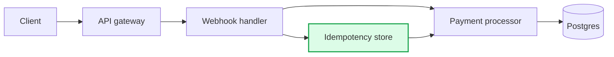
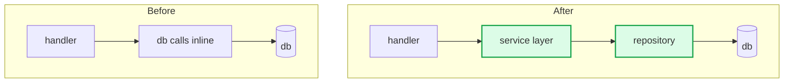
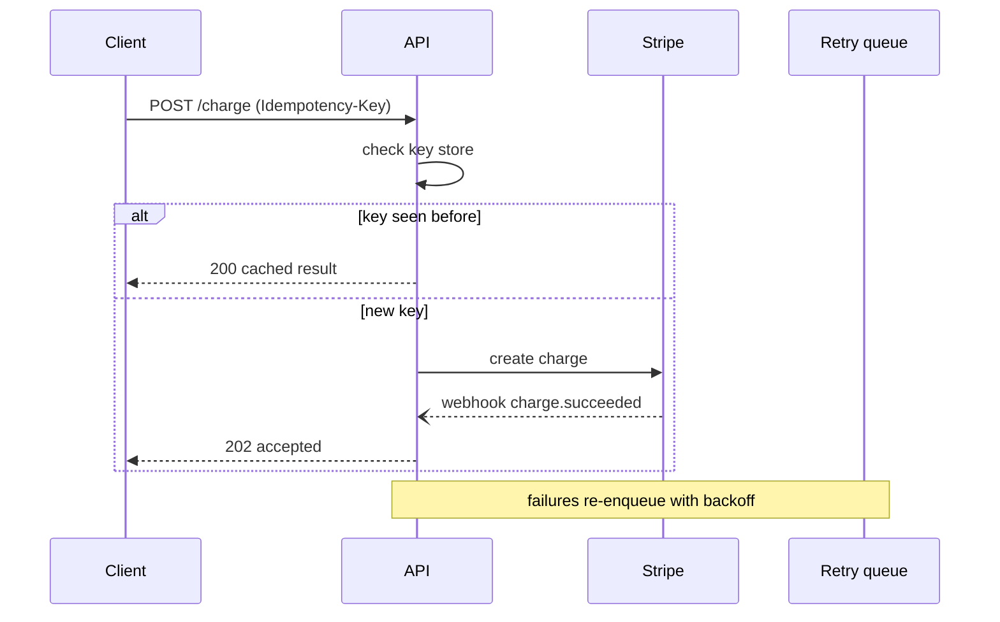
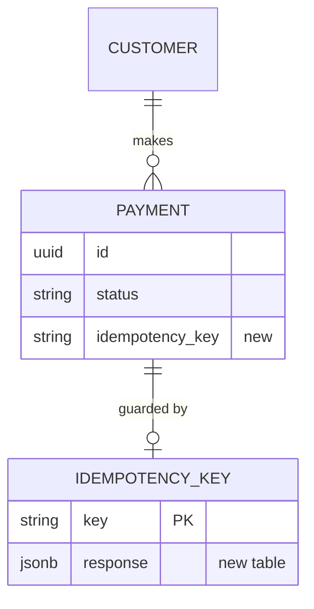
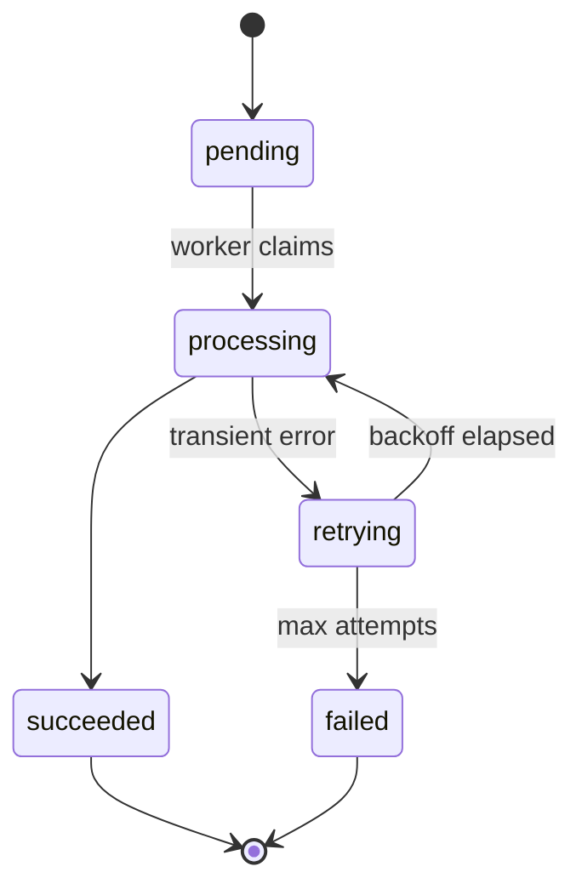
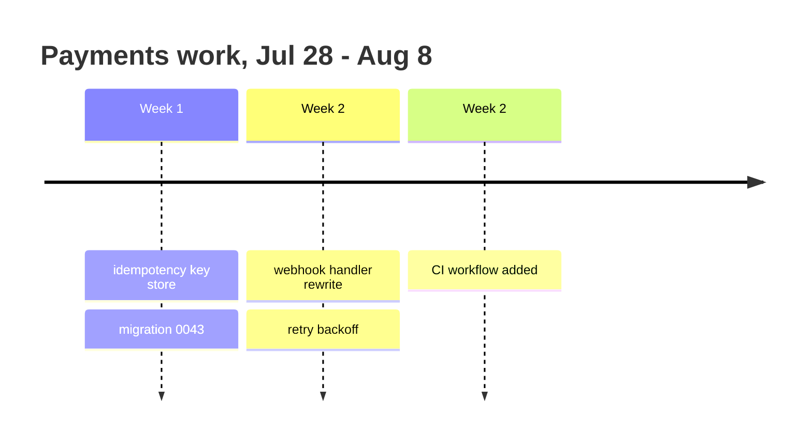
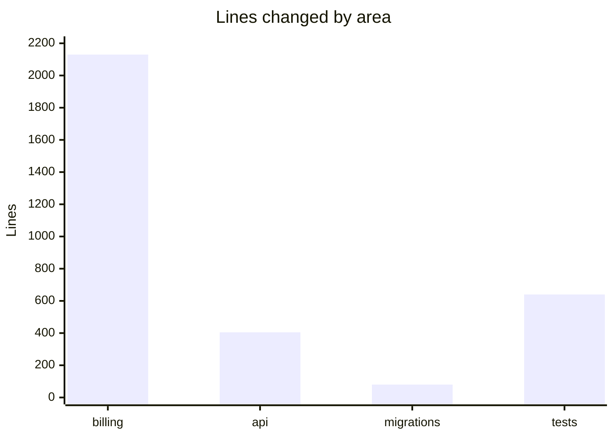

# Diagram patterns

Copy-paste-safe Mermaid for work summaries. Read this when you've decided a diagram earns its place; pick the closest pattern and adapt.

Contents: [Flow through components](#flow-through-components) · [Before/after refactor](#beforeafter-refactor) · [Sequence](#sequence) · [Schema](#schema) · [State](#state) · [Timeline](#timeline) · [Churn chart](#churn-chart) · [Syntax safety](#syntax-safety)

## Flow through components

Highlight what's new so the reader sees the delta immediately.

## Before/after refactor

Two subgraphs in one diagram, no edges crossing between them. Easier to read than two separate diagrams and keeps the comparison on one screen.

Put "After" first when the reader mainly needs the new mental model; put "Before" first when the point is what was wrong.

## Sequence

Best when ordering, retries, or async timing is the substance of the change.

## Schema

Show only the tables the work touched, and mark added columns in the label.

## State

For lifecycle logic — order/job/auth states. Annotate transitions that the work changed.

## Timeline

For a sprint or multi-week window where sequencing matters.

## Churn chart

Only when the distribution is itself informative. A table with inline bars renders everywhere and can't break:

| Area | Churn | |
|---|---|---|
| `billing/` | +1,240 / -890 | ████████████ |
| `api/` | +310 / -95 | ███ |
| `migrations/` | +80 / -0 | █ |

If a real chart is wanted:

## Syntax safety

Where Mermaid quietly breaks:

- **Punctuation in labels** — quote it: `A["handler (v2)"]`. Unquoted parentheses, colons, commas, and slashes are the most common failure.
- **` `** — works in some renderers, not all. Prefer shorter labels or `"line one\nline two"` in quotes.
- **Node IDs** — keep them short and alphanumeric. Never reuse an ID for two different nodes; Mermaid silently merges them.
- **Reserved words** — `end`, `graph`, `class`, `click` as node IDs or bare labels break the parse. Capitalize or quote: `E["end"]`.
- **`classDef` placement** — define classes after the nodes that use them; `:::class` syntax needs no separate `class` statement.
- **Direction inside subgraphs** — `direction LR` works within a subgraph but the outer graph direction wins in some versions. Test by eye, and prefer `TB` outer / `LR` inner.
- **Size** — past roughly 15 nodes the diagram stops helping. Split it or narrow the scope.

Before shipping, reread each diagram once and ask whether a reader who knows nothing about this codebase would draw the right conclusion from it. If it needs a paragraph of explanation to be legible, the paragraph alone was probably the better artifact.
